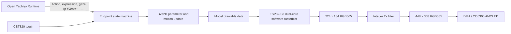

# Open Yachiyo on ESP32-S3

This directory documents a real-time Live2D endpoint for low-cost embedded hardware, including a flashable ESP32-S3 firmware bundle, the rendering architecture, measured performance, and the boundary for future board ports.

- Embedded implementation and hardware validation: **Howtion**
- Validated board: **Waveshare ESP32-S3-Touch-AMOLED-1.8 V2**
- Build environment: **ESP-IDF 5.5.5**
- Hardware validation date: **2026-09-07**

The OpenLive2DSDK source tree, private build scripts, and standalone model assets are not published here. See [HISTORY.md](HISTORY.md) for the early embedded interaction work and the provenance of the reconstructed contribution record.

---

## Hardware Demo

### Standalone display endpoint


The prebuilt firmware running on a Waveshare ESP32-S3-Touch-AMOLED-1.8 V2.

### Robot-mounted endpoint


The same class of ESP32-S3 display used as a local character and touch endpoint on a robot platform.

Both photos were re-encoded without EXIF metadata.

---

## Quick Flash

The tested binary bundle is available at:

- [`firmware/waveshare-esp32-s3-touch-amoled-1.8-v2-atri`](firmware/waveshare-esp32-s3-touch-amoled-1.8-v2-atri/)

The simplest path uses the merged image:

```bash
python -m pip install esptool
python -m esptool --chip esp32s3 \
  --port /dev/cu.usbmodemXXXX --baud 921600 \
  --before default_reset --after hard_reset \
  write_flash --flash_mode dio --flash_freq 80m --flash_size 16MB \
  0x0 openlive2d-atri-v2-complete.bin
```

Use `/dev/ttyACM*` on Linux or `COMx` on Windows. The firmware bundle also contains the separate bootloader, partition table, and application images for development workflows.

This is the exact filtered ATRI build used for the performance and hardware checks below. It includes the runtime and character payload required to boot directly into the demo. Review the redistribution terms of the embedded runtime and character asset before moving the binary into an upstream release.

---

## What This Endpoint Does

Open Yachiyo can keep Agent, ASR, TTS, and conversation state on a desktop or server. The ESP32 endpoint receives small control events and handles model updates, local idle behavior, touch input, and display output.

The device does not receive a continuous character video stream. Idle motion, blinking, breathing, touch feedback, expressions, gaze, and lip parameters continue locally when the network is unavailable.



---

## Technology Stack

| Layer | Technology and responsibility |
|---|---|
| Application and build | C/C++, CMake, ESP-IDF 5.5.5, `idf.py`, esptool |
| Scheduling | FreeRTOS dual-core tasks, queues, task notifications, semaphores |
| Model runtime | PurismCore-compatible core with per-frame `.moc3` updates |
| Software rendering | Textured triangle rasterization, alpha blending, RGB565 framebuffers |
| Texture storage | RGB565 color plane + A8 alpha plane |
| Display | CO5300 AMOLED, logical landscape 448 x 368, asynchronous DMA submission |
| Input | CST820 capacitive touch and BOOT button fallback |
| Hardware | ESP32-S3 dual-core 240 MHz, 16 MB Flash, 8 MB Octal PSRAM |

---

## Validated Hardware

| Item | Configuration |
|---|---|
| Board | Waveshare ESP32-S3-Touch-AMOLED-1.8 V2 |
| SoC | ESP32-S3, dual-core Xtensa, 240 MHz |
| Flash | 16 MB, DIO, 80 MHz |
| PSRAM | 8 MB Octal PSRAM |
| Display controller | CO5300 |
| Touch controller | CST820/CST816S-compatible interface |
| Physical resolution | 368 x 448 |
| Application orientation | Landscape, 448 x 368 |
| Internal render size | 224 x 184 |
| Display format | RGB565 |

The V1 and V2 boards use different display and touch stacks. V1 commonly uses SH8601 + FT3168, while V2 uses CO5300 + CST820. The included firmware is for **V2 only**.

---

## Real-Time Rendering

### Per-frame model evaluation

The firmware loads the `.moc3` model and evaluates parameters, vertices, opacity, and draw order every frame. It then rasterizes the model drawables into an RGB565 framebuffer. The animation is not baked into video or image sequences.

With no touch or button input, the character remains in the idle state. A touch press edge or BOOT button press selects the next action. The endpoint returns to idle after the action finishes.

### RGB565 + A8 textures

Texture data is split into two planes:

- RGB565 stores color in 2 bytes per pixel.
- A8 stores alpha in 1 byte per pixel.

This reduces a 512 x 512 texture from 1 MiB in RGBA8888 to 768 KiB in firmware. At startup, the V2 build combines the planes into a 32-bit PSRAM sampling cache: RGB565 in the lower 16 bits and A8 in the upper byte. One memory read then returns both color and alpha.

The combined cache costs 1 MiB. Ports with less PSRAM can keep the planes separate and trade memory bandwidth for capacity.

### Fixed-point software rasterizer

The ESP32-S3 path increments Q16 texture coordinates across triangle spans and uses a dedicated nearest-neighbor sampler. It avoids repeated floating-point coordinate conversion and keeps blending in RGB565 where possible.

The model is rendered at 224 x 184 and expanded to the 448 x 368 AMOLED output. The main raster workload is therefore one quarter of a full-resolution render.

### Dual-core split

After one model update, both raster tasks read the same immutable drawable state:

- CPU0 draws the left half and also owns asynchronous LCD submission.
- CPU1 runs model updates, frame scheduling, and the right-half raster pass.
- CPU1 waits for the left-half completion notification before filtering and presenting the frame.

Two render canvases and two display canvases live in PSRAM. A canvas submitted to LCD DMA remains read-only until its completion semaphore is returned, preventing tearing and buffer reuse races.

### Lightweight edge filtering

Texture sampling stays on the fast nearest-neighbor path. Smoothing is applied during the fixed 2x display expansion. For source pixel `P00` and its right, bottom, and bottom-right neighbors:

| Output position | RGB565 operation |
|---|---|
| Top-left | `P00` |
| Top-right | `average(P00, P10)` |
| Bottom-left | `average(P00, P01)` |
| Bottom-right | `average(P00, P10, P01, P11)` |

All averages operate on the RGB565 bit fields with integer arithmetic. The filter uses no floating point and requires no additional full-screen buffer.

---

## Measured Performance

Measurements use the same V2 board, 512 x 512 RGB565+A8 character texture, and 224 x 184 internal canvas. They are steady-state averages from the validated build.

| Metric | Filtered build |
|---|---:|
| Model parameter and vertex update | about 18.3 ms/frame |
| Dual-core software raster | about 104.4 ms/frame |
| RGB565 integer expansion and filter | about 21.4 ms/frame |
| LCD submission | about 30.7 ms/frame, overlapped with the next frame |
| Stable display rate | about 6.9 FPS |
| Display rate with filter disabled | about 7.4 FPS |
| Filter frame-rate cost | about 7% |
| Free PSRAM after initialization | 5,697,172 bytes, about 5.43 MiB |

The earlier single-core specialized sampler took about 106 ms for rasterization. The dual-core version overlaps display work more effectively and removes the previous artificial 192 ms frame interval. Software triangle rasterization remains the main bottleneck; `.moc3` evaluation is not the dominant cost.

---

## Open Yachiyo Event Boundary

The public interface passes character intent without exposing model or renderer internals.

| Event | Endpoint behavior |
|---|---|
| `avatar.idle` | Return to idle |
| `avatar.action` | Play an allow-listed action |
| `avatar.look` | Set a normalized gaze or head target |
| `avatar.speak.start` | Enter speaking state |
| `avatar.speak.level` | Drive lip parameters from normalized audio level |
| `avatar.speak.stop` | Close the mouth smoothly and return to idle |
| `device.status` | Report frame rate, memory, and firmware version |

The transport can use USB CDC, UART, Wi-Fi WebSocket, or another small message protocol. The endpoint validates message length, action names, and parameter ranges. A network disconnect leaves the local idle loop running.

---

## Porting Boundary

OpenLive2DSDK source is not part of this directory. A new platform provides the following adapters around the private runtime:

| Boundary | Platform responsibility |
|---|---|
| Memory | Aligned allocation, release, optional external-RAM capability flags |
| Time | Monotonic millisecond or microsecond clock |
| Concurrency | Tasks or threads, queue, notification, and synchronization primitives |
| Display | RGB565 framebuffer submission, completion signal, rotation, byte order |
| Input | Optional touch or key sampling normalized into coordinates and edge events |
| Resources | Read model and texture data from Flash, filesystem, or mapped storage |
| Logging | Disableable levels and performance counters |

A comparable ESP32-S3 target should start with a dual-core MCU near 240 MHz, at least 8 MB external RAM, RGB565 DMA display submission, and an output size that supports integer expansion from the internal canvas.

Single-core ports can use the same pipeline with a smaller canvas, smaller textures, or lower update rate. A hardware 2D accelerator can replace the software raster layer without changing model evaluation, interaction state, or display contracts.

---

## Published Scope

This directory publishes:

- board, display, and touch-controller identification
- prebuilt V2 flash images and SHA-256 checksums
- flash offsets, commands, startup checks, and recovery steps
- rendering architecture, task ownership, memory strategy, and measurements
- the event-level boundary between Open Yachiyo and the endpoint

It does not publish:

- OpenLive2DSDK source or its private build system
- standalone Live2D model or texture files
- SDK debug symbols or ELF files
- API keys, Wi-Fi credentials, or device secrets

The prebuilt ATRI image necessarily contains the runtime and character payload needed by the demonstration firmware. Treat that binary as a hardware-evaluation artifact until its embedded third-party redistribution terms have been reviewed for an upstream release.
