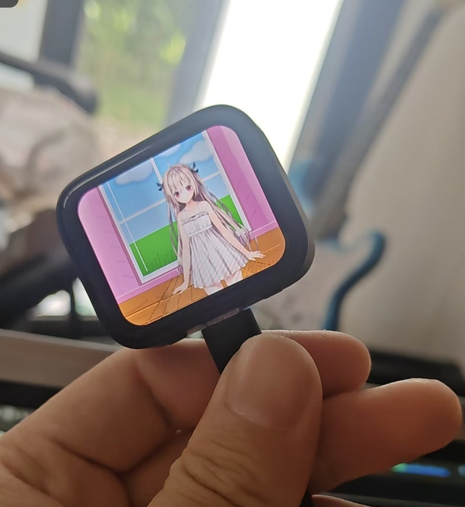
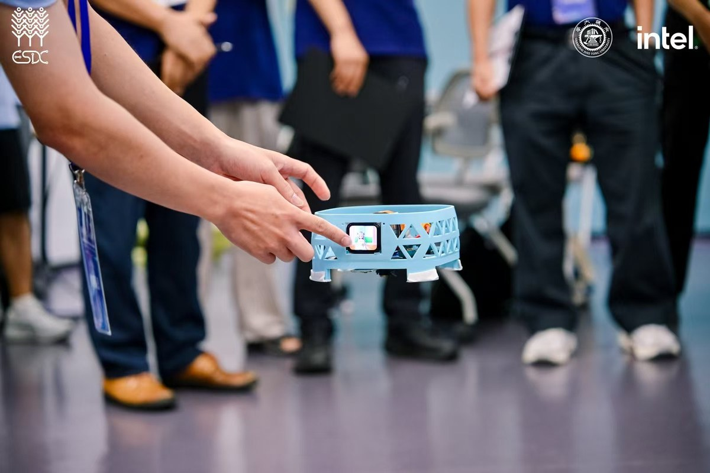
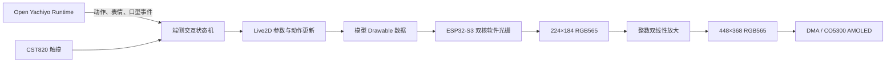

# Open Yachiyo 端侧 ESP32 部署

本目录记录 OpenLive2DSDK 在低成本 MCU 上运行实时二维角色的硬件方案、固件烧录方法与移植边界。这里公开实现原理和已经验证的性能数据，不包含 OpenLive2DSDK 源码、模型素材、私有构建脚本或可反推出 SDK 实现的中间文件。

- 端侧实现与硬件验证：Howtion
- 已验证平台：Waveshare ESP32-S3-Touch-AMOLED-1.8 **V2**
- 已验证固件环境：ESP-IDF 5.5.5
- 验证日期：2026-09-07

早期端侧与实时交互方向的工作脉络见[贡献记录](HISTORY.md)。

## 实机效果

### 独立屏幕终端



预编译固件在 Waveshare ESP32-S3-Touch-AMOLED-1.8 V2 上的实际显示效果。

### 机器人载体部署



同类 ESP32-S3 屏幕模块集成到机器人载体后的现场运行效果，触摸屏作为本地角色显示与交互入口。

两张照片均经过重新编码，未保留原文件的 EXIF 元数据；本仓库不包含照片中模型的素材或 SDK 源码。

## 目标

Open Yachiyo 的 Agent、ASR、TTS 和会话状态可以运行在电脑或服务端；ESP32 只承担角色状态接收、实时模型计算、触摸输入和显示输出。端侧传输的是动作、视线、表情和口型等小型控制事件，无需持续传输角色视频。

这样可以降低网络带宽和显示端功耗，并让待机、眨眼、触摸反馈等动作在网络短暂波动时继续运行。当前硬件验证聚焦 Live2D 实时渲染，语音事件协议属于后续与 Open Yachiyo 主运行时的集成范围。



## 技术栈

| 层次 | 技术与职责 |
| --- | --- |
| 应用与构建 | C/C++、CMake、ESP-IDF 5.5.5、`idf.py`、esptool |
| 实时调度 | FreeRTOS 双核任务、队列、任务通知、信号量 |
| 模型运行 | PurismCore 兼容核心；每帧执行 `.moc3` 模型更新 |
| 软件渲染 | RGB565 帧缓冲、纹理三角形光栅化、透明度与混合 |
| 纹理 | RGB565 颜色平面 + A8 透明度平面 |
| 显示 | CO5300 AMOLED、逻辑横屏 448×368、DMA 提交 |
| 输入 | CST820 电容触摸；BOOT 按键可作为无触摸操作入口 |
| 硬件 | ESP32-S3，双核 240 MHz，16 MB Flash，8 MB Octal PSRAM |

## 已验证硬件

| 项目 | 配置 |
| --- | --- |
| 开发板 | Waveshare ESP32-S3-Touch-AMOLED-1.8 V2 |
| SoC | ESP32-S3，Xtensa 双核，240 MHz |
| Flash | 16 MB，DIO，80 MHz |
| PSRAM | 8 MB Octal PSRAM |
| 屏幕控制器 | CO5300 |
| 触摸控制器 | CST820/CST816S 兼容接口 |
| 物理分辨率 | 368×448 |
| 应用逻辑方向 | 横屏 448×368 |
| 内部渲染分辨率 | 224×184 |
| 显示格式 | RGB565 |

V1 与 V2 的显示和触摸方案不同。V1 常见组合为 SH8601 + FT3168，V2 使用 CO5300 + CST820；两者固件不可直接互刷。本页给出的烧录包和结果只适用于 V2。

## 实时渲染原理

### 模型保持实时计算

固件直接载入 `.moc3`，每帧更新参数、顶点、透明度和绘制顺序，再把 Drawable 三角形光栅化到 RGB565 帧缓冲。待机、眨眼、呼吸、表情和交互动作仍由参数驱动，没有把动画离线烘焙成视频或序列帧。

没有触摸或按钮输入时，角色保持待机状态。触摸按下沿或 BOOT 按键可以按顺序触发动作；动作结束后回到待机。输入层和模型层只通过参数及动作命令连接，后续可以接入 Open Yachiyo 的说话、情绪和工具调用事件。

### RGB565 + A8 纹理

纹理在固件资源中拆为两张平面：

- RGB565 保存颜色，每像素 2 字节。
- A8 保存透明度，每像素 1 字节。

相比 RGBA8888，固件资源从每像素 4 字节降为 3 字节。512×512 纹理的颜色与透明度合计 768 KiB。

启动后可在 PSRAM 中建立每像素 32 位的采样缓存：低 16 位为 RGB565，高 8 位为 A8。光栅阶段一次内存读取即可取得颜色和透明度，减少两张平面分别访问 PSRAM 的开销。该缓存占用 1 MiB，属于以空间换带宽；PSRAM 较小的平台可以关闭缓存并继续使用分离平面。

### 低成本软件光栅

当前 ESP32-S3 路径使用专门的定点最近邻采样：在三角形扫描阶段递增 Q16 纹理坐标，避免为每个像素重复执行浮点坐标换算。颜色仍在 RGB565 中完成透明混合，减少 RGB888 临时展开和转换。

模型渲染分辨率设为 224×184，再输出到 448×368 AMOLED。这样把主要光栅像素数降到全分辨率的四分之一，同时保持屏幕完整输出分辨率。

### 双核分工

每帧完成模型更新后，将同一份只读 Drawable 状态按屏幕左右区域切分：

- CPU0 的光栅任务绘制左半屏，同时承担异步 LCD 提交任务。
- CPU1 负责模型更新、帧调度和右半屏光栅。
- CPU1 等待左半屏任务通知后才进入收尾与放大，保证两半来自同一模型帧。

渲染和显示各使用两张 PSRAM 画布。提交到 LCD 的画布在 DMA 完成前保持只读，信号量归还后才允许下一次复用，避免屏幕撕裂和 DMA 读取到正在改写的数据。

### 轻量消锯齿

纹理光栅保持较快的最近邻路径，消锯齿放在 2 倍显示放大阶段。对源像素 `P00` 及其右、下、右下邻居，生成一个 2×2 输出块：

| 输出位置 | 计算方式 |
| --- | --- |
| 左上 | `P00` |
| 右上 | `average(P00, P10)` |
| 左下 | `average(P00, P01)` |
| 右下 | `average(P00, P10, P01, P11)` |

平均运算直接按 RGB565 的 R/G/B 位域使用整数完成，无浮点运算，也不增加第三张显示帧缓冲。右边界和下边界复用最后一个像素或最后一行。该方法主要平滑人物轮廓、发丝和斜线，代价远低于在每个纹理采样点执行完整双线性过滤。

## 实测性能

下表来自同一块 Waveshare V2 开发板、同一 512×512 RGB565+A8 模型和同一 224×184 内部画布。数值为连续运行后的平均值，不代表其他模型或屏幕配置。

| 指标 | 轻量滤波版本 |
| --- | ---: |
| 模型参数与顶点更新 | 约 18.3 ms/帧 |
| 双核软件光栅 | 约 104.4 ms/帧 |
| RGB565 整数放大与滤波 | 约 21.4 ms/帧 |
| LCD 提交 | 约 30.7 ms/帧，和下一帧计算部分重叠 |
| 稳定显示帧率 | 约 6.9 FPS |
| 滤波关闭时帧率 | 约 7.4 FPS |
| 滤波带来的帧率代价 | 约 7% |
| 初始化完成后的剩余 PSRAM | 约 5.43 MiB（5,697,172 字节） |

双核加速前的单核专用采样光栅约 106 ms；双核版本将计算与显示更充分地重叠，并移除了原有的 192 ms 人为帧间隔。当前瓶颈仍是软件三角形光栅，而非 `.moc3` 模型更新。

## 固件包与烧录

公开发布时建议把预编译固件放在 GitHub Release，仓库只保留本说明。一个完整烧录包应包含：

```text
open-yachiyo-esp32s3-amoled-v2/
  bootloader.bin
  partition-table.bin
  openlive2d_atri_v2.bin
  SHA256SUMS
  README.txt
```

当前已验证镜像的偏移为：

| 偏移 | 文件 |
| ---: | --- |
| `0x0000` | `bootloader.bin` |
| `0x8000` | `partition-table.bin` |
| `0x10000` | `openlive2d_atri_v2.bin` |

安装 Python esptool 后，连接开发板的 USB 数据口并确认串口名。macOS 常见形式为 `/dev/cu.usbmodem*`，Linux 常见形式为 `/dev/ttyACM*`，Windows 使用 `COMx`。

```bash
python -m esptool --chip esp32s3 \
  --port /dev/cu.usbmodemXXXX --baud 921600 \
  --before default-reset --after hard-reset \
  write-flash --flash-mode dio --flash-freq 80m --flash-size 16MB \
  0x0000 bootloader.bin \
  0x8000 partition-table.bin \
  0x10000 openlive2d_atri_v2.bin
```

如果自动进入下载模式失败，可按住 BOOT、短按 RESET，再松开 BOOT 后重试。首次切换分区布局或遇到旧固件残留时可以先执行：

```bash
python -m esptool --chip esp32s3 --port /dev/cu.usbmodemXXXX erase-flash
```

烧录前必须用发布包中的 `SHA256SUMS` 校验文件。当前内部验证版本的应用镜像约 1.7 MiB；公开包的哈希应在每次构建后重新生成，不能沿用内部构建值。

### 启动验收

串口监视波特率为 115200。启动时至少应确认：

1. PSRAM 初始化成功。
2. 模型一致性检查通过并完成初始化。
3. RGB565+A8 运行时缓存创建成功。
4. CPU0 光栅与 LCD 提交任务就绪。
5. CPU1 实时渲染任务就绪并输出首帧。
6. 待机状态持续运行，触摸或 BOOT 按钮能触发动作。

## 与 Open Yachiyo 的接口边界

公开接口只需要传递角色意图，不应暴露模型格式或渲染器内部对象。建议的最小事件集合如下：

| 事件 | 端侧行为 |
| --- | --- |
| `avatar.idle` | 回到待机状态 |
| `avatar.action` | 播放一个允许列表中的动作 |
| `avatar.look` | 设置归一化视线或头部目标 |
| `avatar.speak.start` | 进入说话状态 |
| `avatar.speak.level` | 用归一化音量驱动口型参数 |
| `avatar.speak.stop` | 平滑关闭口型并回到待机 |
| `device.status` | 上报帧率、内存和固件版本 |

传输层可以按产品选择 USB CDC、UART、Wi-Fi WebSocket 或轻量消息协议。端侧应验证消息长度、动作名称和参数范围；网络断开时继续本地待机，不阻塞渲染任务。

## 跨板移植边界

OpenLive2DSDK 源码不随本目录发布。对外移植只约定以下边界，具体实现由维护者提供的 SDK 或预编译库完成：

| 边界 | 新平台需要提供 |
| --- | --- |
| 内存 | 对齐分配、释放、可选外部 RAM 能力标记 |
| 时间 | 单调时钟、毫秒或微秒 tick |
| 并发 | 任务/线程、队列、通知或等价同步原语 |
| 显示 | RGB565 帧缓冲提交、完成通知、旋转和字节序处理 |
| 输入 | 可选触摸/按键采样，统一为归一化坐标与边沿事件 |
| 资源 | 从 Flash、文件系统或映射地址读取模型和纹理 |
| 日志 | 可关闭的分级日志与性能计数器 |

移植时应先建立桌面或主机侧参考渲染，再接显示驱动，最后接触摸和双核优化。以下条件适合作为 ESP32-S3 同级体验的起点：

- 240 MHz 级双核 MCU。
- 至少 8 MB 外部 RAM；低分辨率或更小纹理可降低要求。
- 支持 RGB565 批量提交的 LCD 控制器和 DMA。
- 屏幕分辨率不低于内部渲染画布，并允许整数倍放大。

单核芯片仍可使用相同管线，但应降低内部画布、纹理尺寸或刷新率。没有 PSRAM 的平台应优先取消 32 位纹理缓存和双显示画布，并重新评估模型复杂度。硬件 2D 加速平台可以替换软件光栅层；模型更新、交互状态和显示接口无需随之改变。

## 公开范围

本目录可以公开：

- 板卡型号、芯片和屏幕/触摸控制器信息。
- 固件烧录偏移、命令、验收步骤和故障排查。
- 渲染管线、任务分工、内存策略和性能数据。
- Open Yachiyo 与端侧之间的事件级接口约定。

本目录不公开：

- OpenLive2DSDK 源码与私有构建系统。
- 未获再分发授权的 Live2D 模型、纹理或角色素材。
- 带有模型资源的内部调试固件。
- API 密钥、Wi-Fi 凭据、设备密钥和本地绝对路径。

预编译固件是否公开应按固件内嵌模型、核心库和第三方组件的授权逐项确认。可以单独发布不含角色素材的板级诊断固件，用于验证屏幕、触摸、PSRAM 和烧录流程。
